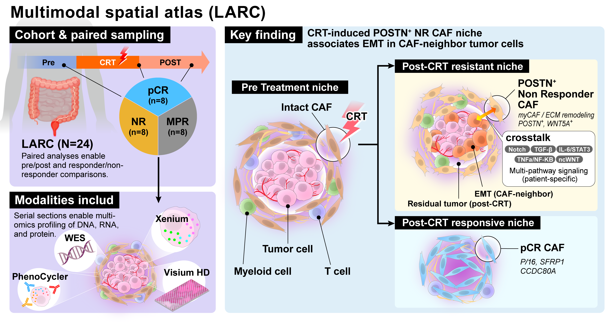

# Rectal Cancer Spatial Multiomics

Code repository for: *Single-cell spatial multiomics identifies POSTN+ CAFs mediating chemoradiotherapy resistance in rectal cancer*



Analysis of 24 rectal cancer patients using 10x Xenium spatial transcriptomics. This repository contains reproducible notebooks for the complete analytical pipeline, from initial cell type annotation through survival analysis.

## Cohort

- **Platform**: 10x Xenium spatial transcriptomics
- **Patients**: 24 rectal cancer patients
- **Timepoints**: Pre-treatment, JustAfter CRT (Pt-3, Pt-5, Pt-11, Pt-13 only), Resection
- **Total samples**: 54

### Response Groups
| Group | Patients | Description |
|-------|----------|-------------|
| NR/SD | Pt-1 to Pt-8 | No Response / Stable Disease |
| MPR | Pt-9 to Pt-16 | Major Pathological Response |
| pCR/CR | Pt-17 to Pt-24 | Pathological Complete Response / Complete Response |

## Repository Structure

```
rectal-cancer-spatial-multiomics/
├── notebooks/
│   ├── 01_major_cluster_annotation.ipynb   # Major cell type annotation and UMAP
│   ├── 02_subcluster_annotation.ipynb      # Stromal/T cell/Myeloid subclustering
│   ├── 03_tumor_analysis.ipynb             # Tumor subclustering and pathway scoring
│   ├── 04_spatial_neighborhood_analysis.ipynb  # Squidpy, SKNY, LIANA
│   ├── 05_temporal_dynamics.ipynb           # Temporal dynamics analysis
│   ├── 06_survival_analysis.ipynb          # KM curves, KRAS, TCGA validation
│   ├── 07_caf_trajectory.ipynb             # CAF STORIES trajectory & fate (stories-rsc-cuda126)
│   ├── 09_skny_gridding.ipynb              # SKNY gridding & distance calculation (skny)
│   ├── 10_caf_spatial_distribution.ipynb   # NR CAF spatial distribution & DEG (skny)
│   ├── 11_tumor_neighbor_analysis.ipynb    # CAF neighbor DEG & pathway (skny)
│   └── 12_ligand_receptor_analysis.ipynb   # Ligand-receptor interaction (skny)
├── data/                                   # Input h5ad files and metadata (not tracked)
├── results/                                # CSV outputs from analyses
├── figures/                                # Publication-ready figures
├── environment.yml
├── requirements.txt
└── .gitignore
```

## Notebooks Overview

### 01 — Major Cluster Annotation
Loads the integrated AnnData object and defines two major cluster labels:
- `Major_cluster`: Epithelial / Stromal / Myeloid / T cell / B cell
- `Major_cluster_pathol`: Tumor / Normal / Stromal / Myeloid / T cell / B cell

Produces UMAP embeddings and cell composition bar plots per sample.

### 02 — Subcluster Annotation
GPU-accelerated subclustering (rapids_singlecell) and Wilcoxon DEG analysis for:
- **Stromal/CAF**: 17 subclusters (c0–c16) including POSTN+ CAF, MMP11+ CAF, ACTA2+ myCAF, RGS5+ pericytes, and PECAM1+ endothelial cells
- **T cells**: 11 subclusters (c0–c10) including KLRG1+ CD8, GZMA+ CD8, Tregs, CXCL13+ CD4, and Mast cells
- **Myeloid**: 13 subclusters (c0–c12) including F13A1+ macrophages, OLR1+ myeloid, CHIT1+ myeloid, and multiple DC subtypes

### 03 — Tumor Analysis
- Tumor subclustering using rapids_singlecell (Leiden resolution=0.5)
- Per-cell pathway scoring via Enrichr/MSigDB Hallmark 2020 (10 pathways including Hypoxia, EMT, KRAS Signaling, PI3K/AKT/mTOR)
- Genomic concordance: KRAS/PIK3CA/MMR status from exome data
- Tumor vs. normal epithelium DEG analysis

### 04 — Spatial Neighborhood Analysis
- Squidpy neighborhood enrichment (Delaunay triangulation) per sample
- SKNY distance-from-tumor analysis for each cell type
- LIANA ligand-receptor inference (CellPhoneDB method, consensus resource)
- Longitudinal tracking of spatial co-localization patterns

### 05 — Temporal Dynamics
- Longitudinal analysis of cell counts, proportions, and spatial densities across timepoints (Pre → JustAfter CRT → Resection)
- Major cluster composition (stacked bar plots) and violin plots with Mann-Whitney U tests
- Per-subcluster temporal dynamics (count, density, proportion) for Tumor, T cell, Myeloid, Stromal/CAF
- UMAP embedding density for tumor cells stratified by Timepoint × Response

### 06 — Survival Analysis
- Kaplan-Meier DFS curves
- Youden-index threshold optimization for spatial features
- KRAS mutation stratification
- TCGA rectal cancer validation (POSTN TPM, KRAS mutation)

### 07 — CAF Trajectory *(conda: stories-rsc-cuda126)*
- STORIES SpaceTime model fitting for CAF trajectory analysis
- CellRank fate probability (NR CAF vs CR CAF)
- Spatial fate mapping and DEG analysis (high vs low fate probability)
- Velocity-based branch analysis with driver gene trends
- TF enrichment (TRRUST)

### 09 — SKNY Gridding *(conda: skny)*
- 10μm spatial gridding per sample using SKNY/stlearn
- Distance calculation from tumor surface (Dijkstra shortest path on contour graph)
- Per-sample h5ad output with distance annotations

### 10 — CAF Spatial Distribution *(conda: skny)*
- NR CAF proportion comparison: peri-tumor vs peri-normal regions
- Wilcoxon signed-rank test with paired violin plots
- DEG analysis: NR CAF vs Normal Fibroblast
- Reactome pathway enrichment

### 11 — Tumor Neighbor Analysis *(conda: skny)*
- CAF-adjacent tumor cell identification (Delaunay spatial graph)
- Per-cell pathway enrichment (MSigDB Hallmark)
- DEG and volcano plots for NR/CR/Other CAF neighbors
- Per-patient pathway analysis and non-canonical WNT analysis

### 12 — Ligand-Receptor Analysis *(conda: skny)*
- Squidpy ligrec and stlearn CCI analysis
- Per-patient LR interaction analysis (WNT, TGF-β, TNF, NOTCH, Hedgehog, VEGF)
- FDR correction (Benjamini-Hochberg) and heatmap visualization

## Installation

```bash
conda env create -f environment.yml
conda activate bicrc-spatial
```

Or with pip:
```bash
pip install -r requirements.txt
```

## Data Requirements

The following input files are expected in the `data/` directory:

| File | Description |
|------|-------------|
| `integrate_adata_filtered.h5ad` | Main integrated AnnData object |
| `integrate_adata_filtered_tumor.h5ad` | Tumor cell subset |
| `integrate_adata_filtered_caf.h5ad` | CAF/Stromal cell subset |
| `integrate_adata_filtered_tcell.h5ad` | T cell subset |
| `integrate_adata_filtered_mye.h5ad` | Myeloid cell subset |
| `integrate_adata_filtered_tumor_normal.h5ad` | Tumor + Normal epithelium |
| `bicrc_integrated_annotated_.h5ad` | Fully annotated concatenated object |
| `BICRC_SKNY_tumor_{sample}.h5ad` | Per-sample SKNY distance files |
| `exome.txt` | Genomic alterations (RAS, PIK3CA, MMR) |
| `bicrc_metadata.txt` | Clinical/survival metadata |
| `ligand_receptor_around_tumor3.txt` | Pre-computed LIANA LR results |
| `crc_postn.txt` | TCGA CRC POSTN TPM |
| `rect_postn.txt` | TCGA Rectal POSTN TPM |
| `tcga_kras_colon_rect.tsv` | TCGA KRAS mutation status |
| `cell_area.txt` | Tissue area (μm²) per sample |
| `cell_count.txt` | Total cell count per sample |
| `tumor_bed_pt22.csv` | Tumor bed annotation for Pt-22 (Notebook 07) |
| `tumor_bed_pt24.csv` | Tumor bed annotation for Pt-24 (Notebook 07) |
| `trrust_rawdata.human.tsv` | TRRUST TF-target database (Notebook 07) |

## Conda Environments

| Environment | Notebooks | Key Packages |
|-------------|-----------|--------------|
| `bicrc-spatial` | 01–06 | scanpy, squidpy, rapids_singlecell, gseapy, liana, lifelines |
| `stories-rsc-cuda126` | 07 | stories, cellrank, rapids_singlecell, jax, optax |
| `skny` | 09–12 | skny, stlearn, squidpy, gseapy, OpenCV |

## Key Dependencies

- **scanpy** >= 1.9: Single-cell analysis
- **squidpy** >= 1.2: Spatial analysis and neighborhood enrichment
- **rapids_singlecell**: GPU-accelerated clustering (requires CUDA)
- **gseapy**: Pathway scoring via Enrichr
- **liana**: Ligand-receptor interaction analysis
- **lifelines**: Kaplan-Meier survival analysis
- **stories**: SpaceTime optimal transport trajectory inference (requires JAX)
- **cellrank**: Fate probability and lineage analysis
- **skny / stlearn**: Spatial gridding and cell-cell interaction
- **OpenCV (cv2)**: Contour detection for distance calculation
